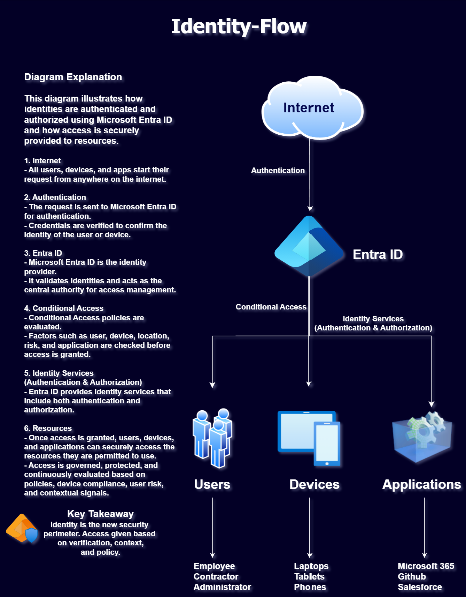

# Microsoft Entra ID Identity Security Project

## Phase 1 – Identity Fundamentals

### Day 1 – Identity Security Fundamentals

---

## Project Objective

This project was created to develop practical Identity and Access Management (IAM) skills while preparing for the SC-300 certification. The objective is to understand Microsoft Entra ID concepts through architecture design, documentation, assessments, and hands-on exercises.

---

## Topics Covered

During Day 1, the following concepts were studied:

- Identity
- Authentication
- Authorization
- Identity Providers
- Active Directory vs Entra ID
- Zero Trust Principles
- Single Sign-On (SSO)
- Conditional Access
- Privileged Identity Management (PIM)
- Service Principals
- Entra Connect Sync

---

## Architecture Overview

The following architecture diagram was created during Day 1 to demonstrate foundational Identity and Access Management concepts within Microsoft Entra ID.

Concepts demonstrated include:

- Authentication
- Conditional Access
- Identity Services
- Authorization
- Zero Trust
- Resource Access
- Users
- Devices
- Applications

### Diagram

---

## Key Takeaway

Identity is the new security perimeter.

Access decisions should be made based on:

- Identity
- Device Trust
- Risk
- Context
- Organizational Policy

---

## Deliverables

Completed Deliverables:

- Identity Architecture Diagram
- Study Notes
- Knowledge Assessment
- Lab Documentation
- Evidence of Completion
- GitHub Repository Structure
