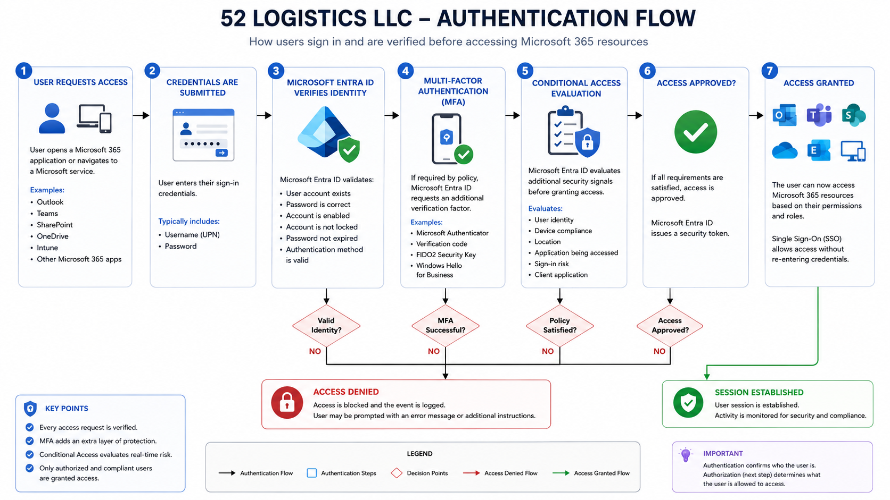

# Authentication Flow

## Purpose

This document describes how users authenticate to Microsoft Entra ID before accessing company resources. Authentication is the process of verifying a user's identity before access to Microsoft 365 services is granted.

Every sign-in request within the 52 Logistics LLC environment follows this authentication process, regardless of whether the user is accessing Outlook, Microsoft Teams, SharePoint, OneDrive, Exchange Online, Microsoft Intune, or another Microsoft 365 service.

---

## Authentication Flow Diagram

The following diagram illustrates the complete authentication process used within the 52 Logistics LLC Microsoft Entra ID environment. It provides a high-level view of how user credentials are verified, how additional security controls such as Multi-Factor Authentication (MFA) and Conditional Access are evaluated, and how Microsoft Entra ID ultimately grants or denies access to Microsoft 365 resources.

<p align="center">
  
</p>

---

# What is Authentication?

Authentication answers one simple question:

> **"Are you really who you claim to be?"**

Before any user can access company resources, Microsoft Entra ID must verify their identity using one or more authentication methods.

---

# Authentication Components

The authentication process consists of several components working together.

### User

The person attempting to sign in.

---

### Microsoft Entra ID

The organization's centralized identity provider.

It validates credentials and determines whether authentication is successful.

---

### Authentication Methods

Users may verify their identity through one or more methods including:

- Password
- Microsoft Authenticator
- Multi-Factor Authentication (MFA)
- Windows Hello for Business
- FIDO2 Security Keys
- Temporary Access Pass (future implementation)

---

### Conditional Access

After authentication, Conditional Access evaluates additional security signals before deciding whether access should be allowed.

Examples include:

- User identity
- Device compliance
- User location
- Risk level
- Application being accessed
- Client application

Conditional Access policies are implemented later in this project.

---

# Authentication Workflow

The authentication process follows these steps.

## Step 1 – User Requests Access

A user opens a Microsoft 365 application or navigates to a Microsoft service.

Examples include:

- Outlook
- Teams
- SharePoint
- OneDrive
- Exchange Online
- Microsoft Intune

---

## Step 2 – Credentials Are Submitted

The user enters their sign-in credentials.

Typically this includes:

- Username
- Password

Additional authentication methods may also be required.

---

## Step 3 – Microsoft Entra ID Verifies Identity

Microsoft Entra ID validates:

- User account exists
- Password is correct
- Account is enabled
- Account is not locked
- Password has not expired
- Authentication method is valid

If verification fails, authentication is denied.

---

## Step 4 – Multi-Factor Authentication (Future Phase)

If required by policy, Microsoft Entra ID requests an additional verification factor.

Examples include:

- Microsoft Authenticator approval
- Verification code
- FIDO2 Security Key
- Windows Hello for Business

This significantly reduces the risk of compromised passwords.

---

## Step 5 – Conditional Access Evaluation (Future Phase)

After authentication succeeds, Conditional Access evaluates additional security conditions before granting access.

Examples include:

- Is the device compliant?
- Is the sign-in location trusted?
- Is the application approved?
- Is user risk acceptable?
- Is sign-in risk acceptable?

Conditional Access acts as a second layer of security.

---

## Step 6 – Authentication Successful

If all authentication requirements are satisfied, Microsoft Entra ID issues a security token.

This token allows the user to access approved Microsoft 365 services without repeatedly entering credentials.

---

# Authentication Flow Diagram

The authentication process can be summarized as:

```

User Opens Application

↓

Enter Username & Password

↓

Microsoft Entra ID Validates Identity

↓

MFA Required?

↓

Yes → Complete MFA

↓

Conditional Access Evaluation

↓

Access Approved?

↓

Yes → Security Token Issued

↓

Access Microsoft 365 Resources

```

If any step fails, access is denied.

---

# Authentication Security

Authentication protects the organization by ensuring that only verified users can access company resources.

Security is strengthened through:

- Strong passwords
- Multi-Factor Authentication
- Passwordless authentication
- FIDO2 security keys
- Windows Hello for Business
- Conditional Access
- Identity Protection

These technologies reduce the likelihood of unauthorized access.

---

# Future Enhancements

The authentication process documented here will later be expanded through:

- Authentication Methods Policies
- Passwordless Authentication
- Microsoft Authenticator
- Temporary Access Pass
- Windows Hello for Business
- FIDO2 Security Keys
- Risk-Based Authentication
- Conditional Access Policies

Each feature will be implemented and documented in later sections of this project.

---

# Summary

Authentication is the first security checkpoint within the Microsoft Entra ID environment.

Every user requesting access must first prove their identity before Microsoft Entra ID evaluates additional security controls and grants access to organizational resources.

By centralizing authentication within Microsoft Entra ID, 52 Logistics LLC maintains a secure, scalable, and consistent identity platform capable of protecting access to Microsoft 365 services.