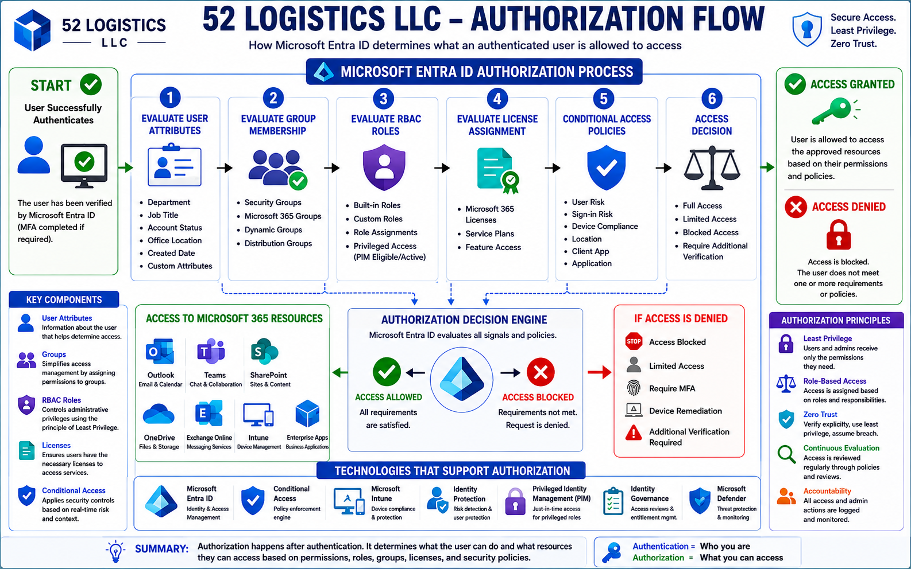

# Authorization Flow

## Purpose

This document explains how Microsoft Entra ID determines what an authenticated user is allowed to access within the 52 Logistics LLC Microsoft 365 environment.

Authentication verifies a user's identity. Authorization determines what resources that authenticated user can access based on assigned permissions, group memberships, administrative roles, and organizational security policies.

Authorization ensures users receive only the level of access required to perform their job responsibilities while protecting sensitive company resources.

---

## Authorization Flow Diagram

The following diagram illustrates how Microsoft Entra ID determines what an authenticated user is permitted to access after a successful sign-in. Authorization decisions are based on several factors, including user attributes, group memberships, administrative roles, license assignments, and Conditional Access policies.

The goal of this process is to ensure users receive only the permissions required to perform their job responsibilities while protecting organizational resources through the principles of Least Privilege and Zero Trust.

  

---

# What is Authorization?

Authorization answers one simple question:

> **"Now that we know who you are, what are you allowed to access?"**

Every user who successfully signs in must still be evaluated before access to applications, files, administrative functions, or company resources is granted.

---

# Authorization Components

Several identity components work together to determine a user's level of access.

## User Identity

Every authorization decision begins with an authenticated Microsoft Entra ID user account.

The authenticated identity contains information such as:

- User Principal Name (UPN)
- Department
- Job Title
- Assigned Roles
- Group Memberships
- License Assignments

---

## Group Membership

Groups simplify authorization by assigning permissions to collections of users rather than individual accounts.

52 Logistics LLC will utilize:

- Security Groups
- Microsoft 365 Groups
- Dynamic Groups

As employees change roles, group membership automatically updates their access where appropriate.

---

## Role-Based Access Control (RBAC)

Administrative permissions are assigned through Microsoft Entra ID administrative roles.

Examples include:

- Global Administrator
- User Administrator
- Groups Administrator
- License Administrator
- Helpdesk Administrator
- Intune Administrator

This follows the principle of Least Privilege by granting only the permissions necessary to perform assigned responsibilities.

---

## Licensing

Certain Microsoft 365 services require users to have the appropriate license before access is permitted.

Examples include:

- Exchange Online
- Microsoft Teams
- Microsoft Intune
- SharePoint Online
- Microsoft Entra ID P1 features

---

## Conditional Access

Conditional Access provides an additional authorization layer by evaluating security signals before granting access.

Examples include:

- Device compliance
- User risk
- Sign-in risk
- Location
- Client application
- Application being accessed

---

# Authorization Workflow

The authorization process follows these steps.

## Step 1 – Authentication Completes Successfully

The user has successfully verified their identity through Microsoft Entra ID.

---

## Step 2 – User Attributes Are Evaluated

Microsoft Entra ID reviews user attributes including:

- Department
- Job Title
- Assigned License
- Account Status
- Group Memberships

---

## Step 3 – Administrative Roles Are Evaluated

Administrative permissions are determined using assigned Microsoft Entra ID roles.

Only authorized administrators receive elevated privileges.

---

## Step 4 – Group Membership Is Evaluated

Microsoft Entra ID determines which permissions the user inherits through group membership.

This simplifies access management and improves scalability.

---

## Step 5 – Conditional Access Policies Are Evaluated

Conditional Access evaluates additional security requirements before allowing access.

If any policy requirement fails, access is denied.

---

## Step 6 – Access Decision

Microsoft Entra ID makes a final authorization decision.

Possible outcomes include:

- Full Access
- Limited Access
- Blocked Access

---

## Step 7 – Resource Access

Authorized users gain access only to approved resources.

Examples include:

- Outlook
- Teams
- SharePoint
- OneDrive
- Exchange Online
- Microsoft Intune
- Enterprise Applications

---

# Authorization Security

Authorization protects organizational resources by ensuring that authenticated users can access only what they have been explicitly permitted to use.

Security is strengthened through:

- Role-Based Access Control (RBAC)
- Security Groups
- Dynamic Groups
- Administrative Roles
- Least Privilege
- Conditional Access
- Identity Governance
- Access Reviews

---

# Future Implementation

The authorization process documented here will be expanded through:

- Security Group Management
- Dynamic Group Rules
- Administrative Role Assignments
- Administrative Units
- Privileged Identity Management (PIM)
- Access Reviews
- Entitlement Management
- Conditional Access Policies
- Identity Governance

Each of these technologies will be configured and documented throughout later phases of this project.

---

# Summary

Authorization is responsible for determining what an authenticated user is permitted to access within the 52 Logistics LLC Microsoft 365 environment.

By combining Role-Based Access Control, group memberships, licensing, Conditional Access, and organizational security policies, Microsoft Entra ID ensures that users receive only the access required to perform their job responsibilities while protecting company resources from unauthorized access.