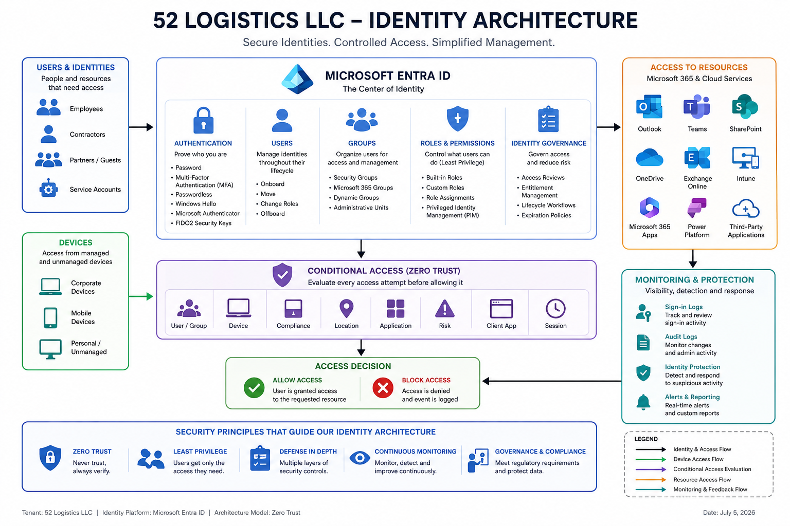

# Identity Design

## Purpose

This document defines the identity architecture for 52 Logistics LLC using Microsoft Entra ID. It establishes the design decisions that will govern how users, groups, administrative roles, authentication, and access to Microsoft 365 resources are managed throughout the organization.

The objective is to provide a secure, scalable, and manageable identity platform that supports current business operations while allowing future growth.

---

## Identity Architecture Diagram

The following diagram provides a high-level overview of the identity architecture implemented for 52 Logistics LLC. It illustrates how Microsoft Entra ID serves as the organization's centralized Identity and Access Management (IAM) platform, managing users, authentication, authorization, governance, and secure access to Microsoft 365 services.

The diagram also introduces the core technologies and security concepts that will be implemented throughout later sections of this project, including Role-Based Access Control (RBAC), Multi-Factor Authentication (MFA), Conditional Access, Identity Governance, and Zero Trust.

  

---

# Identity Platform

**Identity Provider**

Microsoft Entra ID serves as the centralized identity provider for the organization.

Every authentication request, authorization decision, and administrative action is processed through Microsoft Entra ID.

This provides a single source of identity for users accessing Microsoft 365 services such as Outlook, Teams, SharePoint, OneDrive, Intune, and Exchange Online.

---

# Identity Model

52 Logistics LLC uses a **cloud-only identity model**.

User accounts are created directly within Microsoft Entra ID rather than synchronized from an on-premises Active Directory environment.

This design was selected because:

- The organization does not maintain on-premises domain controllers.
- Identity management is centralized within Microsoft 365.
- Administrative overhead is reduced.
- Cloud services can be deployed more quickly.
- The environment is easier to scale as the company grows.

---

# User Lifecycle

Every employee follows the same identity lifecycle.

### Joiner

New employee accounts are created within Microsoft Entra ID.

Each account receives:

- User Principal Name (UPN)
- Display Name
- Department
- Job Title
- Office Location
- Assigned License
- Security Group Membership
- Microsoft 365 Group Membership

---

### Mover

When an employee changes departments or job responsibilities:

- Group memberships are reviewed.
- Administrative roles are updated.
- Licensing is validated.
- Access permissions are adjusted.
- Conditional Access policies continue to apply based on the employee's new role.

---

### Leaver

When employment ends:

- User account is disabled.
- Active sessions are revoked.
- Group memberships are removed.
- Licenses are reclaimed.
- Administrative roles are removed.
- Account retention follows company policy.

---

# Identity Objects

The Microsoft Entra tenant contains several identity object types.

## Users

Represent employees, administrators, contractors, and guests.

---

## Groups

Used to simplify administration by assigning permissions to groups instead of individual users.

The organization will use:

- Security Groups
- Microsoft 365 Groups
- Dynamic Groups

---

## Administrative Roles

Administrative permissions are assigned through built-in Microsoft Entra roles using the principle of Least Privilege.

Examples include:

- Global Administrator
- User Administrator
- Groups Administrator
- Helpdesk Administrator
- License Administrator
- Intune Administrator

---

## Devices

Devices become trusted identity objects once enrolled into Microsoft Intune.

Their compliance status will later influence Conditional Access decisions.

---

## Applications

Enterprise applications authenticate through Microsoft Entra ID to provide secure access for users.

---

# Access Model

Access decisions follow a layered model.

User Identity

↓

Authentication

↓

Group Membership

↓

Administrative Role

↓

Conditional Access Evaluation

↓

Application Authorization

↓

Access Granted or Denied

---

# Security Strategy

Identity security follows several guiding principles.

## Zero Trust

Every sign-in request is evaluated before access is granted.

No identity is trusted automatically.

---

## Least Privilege

Users receive only the permissions necessary to perform their assigned responsibilities.

---

## Role-Based Access Control (RBAC)

Administrative permissions are assigned through Microsoft Entra roles instead of assigning Global Administrator permissions broadly.

---

## Identity Governance

Access is reviewed throughout the employee lifecycle to ensure permissions remain appropriate.

---

# Future Implementation

The architecture defined in this document will support future implementation of:

- Security Groups
- Dynamic Groups
- Administrative Units
- Role Assignments
- Multi-Factor Authentication
- Conditional Access
- Identity Protection
- Privileged Identity Management (PIM)
- Identity Governance
- Microsoft Intune Device Management

Each of these components will be implemented and documented in later sections of this project.

---

# Summary

Microsoft Entra ID serves as the central identity platform for 52 Logistics LLC.

By managing authentication, authorization, administrative roles, and identity governance from a single platform, the organization gains a secure and scalable identity infrastructure capable of supporting future Microsoft 365 and cloud services while following Zero Trust and Least Privilege security principles.