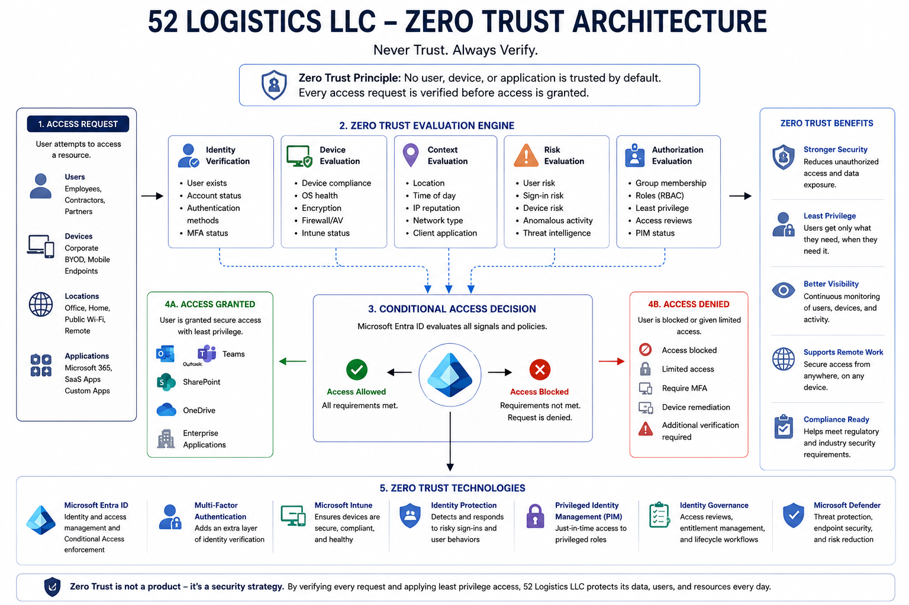

# Zero Trust Security Model

## Purpose

This document describes the Zero Trust security model adopted by 52 Logistics LLC for its Microsoft Entra ID environment.

Rather than assuming users, devices, or applications can be trusted simply because they are inside the organization's network, every access request must be verified before access is granted.

Zero Trust is the guiding security philosophy for this project and influences every identity, authentication, authorization, and access management decision implemented throughout later phases.

---

## Zero Trust Architecture Diagram

The following diagram illustrates how 52 Logistics LLC applies Microsoft's Zero Trust security model within its Microsoft Entra ID environment. Every access request is evaluated using multiple identity and security signals—including user identity, device health, context, risk, and authorization—before access to organizational resources is granted.

Rather than relying on network location or implicit trust, Microsoft Entra ID continuously verifies every request using the principles of **Never Trust, Always Verify**, **Least Privilege**, and **Assume Breach**.

  

---

# What is Zero Trust?

Zero Trust is a modern cybersecurity framework based on one simple principle:

> **Never trust. Always verify.**

Every request to access company resources is evaluated regardless of where the request originates.

Instead of automatically trusting users because they are employees or connected to the company network, Microsoft Entra ID evaluates identity, device health, location, risk, and security policies before making an access decision.

---

# Why 52 Logistics LLC Uses Zero Trust

As the organization grows and expands its Microsoft 365 environment, employees will access company resources from:

- Office workstations
- Corporate laptops
- Mobile devices
- Home networks
- Remote locations
- Cloud applications

Because traditional network boundaries no longer provide adequate protection, security decisions must be based on identity rather than location.

---

# Core Zero Trust Principles

## Verify Explicitly

Every sign-in request is evaluated before access is granted.

Verification includes:

- User identity
- Password or passwordless authentication
- Multi-Factor Authentication (MFA)
- Device compliance
- User risk
- Sign-in risk
- Location
- Application being accessed

---

## Use Least Privilege

Users receive only the permissions necessary to perform their assigned responsibilities.

Examples include:

- Help Desk technicians cannot manage billing.
- HR personnel cannot administer Intune.
- Sales employees cannot manage security policies.
- Global Administrator permissions are assigned only when required.

---

## Assume Breach

Security controls are designed with the assumption that an attacker may already have compromised a password or device.

Additional security layers help reduce the impact of compromised credentials.

Examples include:

- Multi-Factor Authentication
- Conditional Access
- Identity Protection
- Privileged Identity Management (PIM)
- Access Reviews
- Sign-In Monitoring

---

# Zero Trust Architecture

The identity architecture supports Zero Trust by evaluating several factors before granting access.

Authentication

↓

Identity Verification

↓

Device Evaluation

↓

Conditional Access

↓

Role Evaluation

↓

Permission Validation

↓

Access Decision

---

# Identity Signals Evaluated

Microsoft Entra ID evaluates multiple security signals during every sign-in.

These include:

- User identity
- Group membership
- Assigned administrative role
- Device compliance
- Geographic location
- Application being accessed
- Sign-in risk
- User risk
- Client application

No single factor alone determines whether access is granted.

---

# Zero Trust Technologies

The following Microsoft technologies support the organization's Zero Trust strategy.

| Technology | Purpose |
|------------|---------|
| Microsoft Entra ID | Central identity provider |
| Multi-Factor Authentication | Verifies user identity |
| Conditional Access | Evaluates security policies |
| Microsoft Intune | Evaluates device compliance |
| Identity Protection | Detects risky sign-ins |
| Privileged Identity Management (PIM) | Controls privileged access |
| Identity Governance | Reviews and manages access |
| Microsoft Defender | Detects and responds to threats |

---

# Benefits

Implementing Zero Trust provides several benefits.

- Reduces unauthorized access
- Protects privileged accounts
- Limits lateral movement
- Improves visibility
- Supports regulatory compliance
- Strengthens identity security
- Simplifies secure remote work
- Reduces attack surface

---

# Future Implementation

The Zero Trust model established in this section will be implemented throughout later phases of the project.

Future implementations include:

- Multi-Factor Authentication
- Authentication Methods
- Conditional Access Policies
- Device Compliance Policies
- Identity Protection
- Privileged Identity Management
- Identity Governance
- Microsoft Intune Compliance
- Microsoft Defender Security Controls

---

# Summary

Zero Trust serves as the security foundation for the 52 Logistics LLC Microsoft 365 environment.

Rather than relying on traditional network boundaries, every request for access is evaluated using identity, device health, organizational policies, and security signals before Microsoft Entra ID grants access.

This approach helps protect company resources while providing employees with secure access to Microsoft 365 services regardless of where they work.