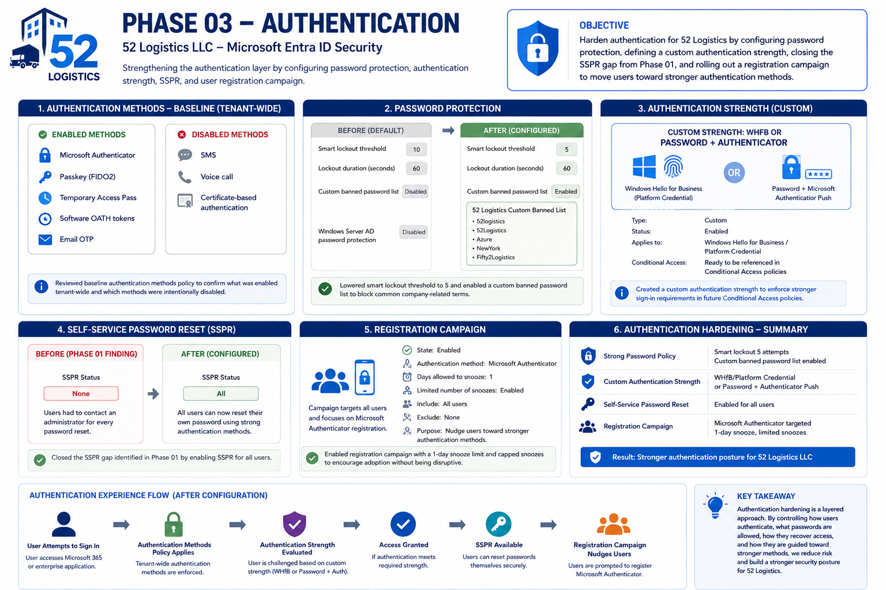

# Phase 03 — Authentication

## Overview

With Phase 01 identifying that the tenant was relying entirely on baseline security defaults, and Phase 02 establishing how identities and access are structured, this phase focuses on strengthening the actual authentication layer for 52 Logistics LLC. That means going beyond simply having MFA available and configuring the specific controls that determine how strong that authentication actually is, what passwords are allowed, and how users are nudged toward better methods over time.

---

## Authentication Architecture

  

<i>Figure 1. Authentication hardening implemented for the 52 Logistics Microsoft Entra tenant.</i>

---

## Objective

Harden authentication for 52 Logistics by configuring password protection, defining a custom authentication strength, closing the SSPR gap identified in Phase 01, and rolling out a registration campaign to move users toward stronger authentication methods.

---

## What I Built

I reviewed the tenant's baseline authentication methods policy to confirm what was already enabled tenant-wide, Microsoft Authenticator, Passkey (FIDO2), Temporary Access Pass, Software OATH tokens, and Email OTP, with SMS, Voice call, and certificate-based authentication left disabled.

From there, I tightened password protection by lowering the smart lockout threshold from the default of 10 attempts to 5, and enabled a custom banned password list specific to 52 Logistics, blocking obvious company-related terms attackers would try first.

I created a custom authentication strength requiring either Windows Hello for Business/Platform Credential, or Password plus Microsoft Authenticator push notification, giving the tenant a defined strength to reference once Conditional Access policies are built in the next phase.

I addressed the Phase 01 finding directly by enabling self-service password reset for all users, replacing the previous "None" configuration that forced every reset through an administrator.

Finally, I enabled a registration campaign targeting Microsoft Authenticator, nudging all users toward stronger authentication with a one-day snooze limit and a capped number of snoozes, rather than leaving registration entirely passive.

---

## PowerShell Automation

No PowerShell automation was used in this phase. All configuration was performed directly through the Entra admin center, since these are one-time tenant-level policy settings rather than repeatable operational tasks like user lifecycle actions.

---

## Decisions and Rationale

See decisions.md for the reasoning behind each configuration choice made in this phase.

---

## Evidence

Screenshots for each step are stored in the screenshots folder, covering the authentication methods baseline, password protection before and after, the custom authentication strength, SSPR before and after, and the registration campaign configuration.

---

## Troubleshooting

See troubleshooting.md for issues and constraints encountered during this phase, including the decision to defer Windows Hello for Business hands-on testing.

---

## Key Takeaway

This phase demonstrates that authentication hardening isn't a single switch, it's a set of layered decisions: what passwords are allowed, what strength is required, how users recover access, and how they're guided toward better methods over time. Closing the SSPR gap identified in Phase 01 here also shows the project actually following through on its own findings rather than just cataloging them.