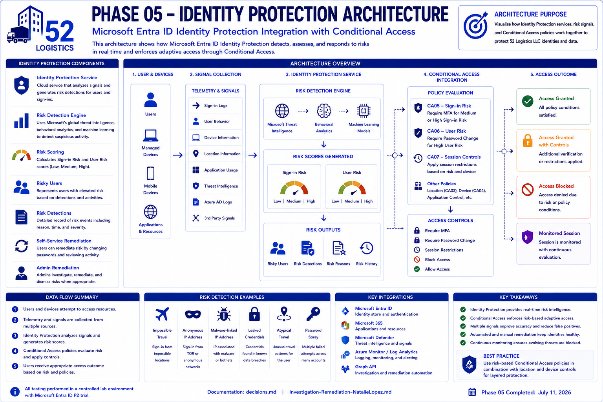

# Phase 05: Identity Protection

This phase covers Microsoft Entra ID Protection: risk detections, risky users and sign-ins, and risk-based Conditional Access policies. It maps to the Identity Protection domain in SC-300 and builds directly on the Conditional Access foundation from Phase 04.

52 Logistics LLC came out of Phase 01 with no differentiated access policy at all, running entirely on Security Defaults. Phase 04 closed that gap with location, device, and session-based controls. Phase 05 adds a risk layer on top: detecting compromised credentials and suspicious sign-in behavior, then responding to that risk automatically through Conditional Access.

---

## Identity Protection Architecture

The following architecture diagram shows how Microsoft Entra ID Protection collects identity signals, calculates sign-in risk and user risk, passes those signals into Conditional Access, and applies the appropriate access controls for 52 Logistics LLC.

---

## Licensing

Risk detections and risk-based Conditional Access require Entra ID P2, which the tenant didn't have going into this phase. I activated the 30-day P2 trial and licensed three accounts: my own admin account, a non-admin department user (Natalie Lopez), and a dedicated test account (Jordan Reed). Full reasoning for the license count is in decisions.md.

## What was built

Two new Conditional Access policies, both following the same Report-only validation pattern established in Phase 04.

**CA05 - SignInRisk - RequireMFA**
Targets Medium and High sign-in risk. Grant control: require multifactor authentication.

**CA06 - UserRisk - RequirePasswordChange**
Targets High user risk. Grant control: require password change.

The two risk signals are kept in separate policies rather than combined into one, since sign-in risk and user risk are evaluated on different timelines and rarely overlap on the same event. Details in decisions.md.

---

## Validation

The tenant is a fresh developer environment with no sign-in history, so neither policy had real risk activity to evaluate against out of the gate. I generated test signals for both:

**User risk (CA06):** Used the Microsoft Graph riskyUsers confirmCompromised action to manually set Natalie Lopez's risk state to High, a documented Microsoft testing method for exactly this purpose.

**Sign-in risk (CA05):** Signed in as Natalie Lopez through Tor Browser. The anonymizing exit node tripped ID Protection's Anonymous IP address detection.

Both policies evaluated correctly in Report-only against their respective test signals. CA05 returned a Report-only Success result tied to the Anonymous IP address detection. CA06 returned a Report-only User action required result tied to the confirmed-compromised risk state.

## Key finding: risk signals catch what location rules miss

One of the Tor sign-in attempts happened to route through an exit node that geolocated inside the US, so CA03 (the geo-block policy from Phase 04) let it through. ID Protection still flagged it as an Anonymous IP address detection, since the anonymizing traffic pattern gave it away regardless of the apparent location.

This shows CA03 and CA05 covering different ground. A location-based block only stops what looks foreign. A risk-based policy catches anonymization and proxy behavior even when the apparent location looks completely normal. Both layers matter, and neither one substitutes for the other.

---

## Current state

**CA05 (Sign-in risk, Require MFA):** validated in Report-only against the Tor sign-in and the Anonymous IP address detection. Staying in Report-only intentionally until this tenant has more sign-in history to baseline against. Reasoning in decisions.md.

**CA06 (User risk, Require password change):** validated and enforced. The triggering condition was a deliberate admin-confirmed compromise action, which made this one safe to move to On immediately.

**CA07 (Session hardening for high user risk):** built and validated in Report-only. Targets High user risk, the same trigger as CA06, but uses session controls instead of grant controls, requiring reauthentication every sign-in and disabling persistent browser sessions. Handles the ongoing session behavior of a flagged account while CA06 handles the immediate credential response. Reasoning and a licensing caveat about which apps fully support session controls are in decisions.md.

**Natalie Lopez:** risk state intentionally held open for several days after initial validation to test whether CA06 would resolve a real case on its own. It did, a live sign-in was challenged, she completed the required password change, and her risk state moved to Remediated automatically. Full writeup in Investigation-Remediation-NatalieLopez.md.

---

## Real-world complications

Documented in full in decisions.md: a PowerShell scripting error on the first Graph script attempt, a wrong API endpoint path on the second attempt, and a licensing propagation delay between when Conditional Access started evaluating risk conditions and when the identityProtection risk management API recognized the same P2 license.