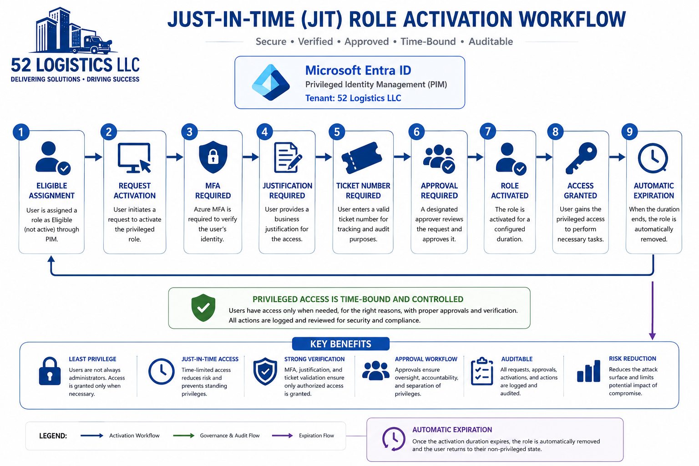

# Phase 06: Privileged Access

Standing admin access is a liability sitting in wait. Every account that holds Global Admin, User Administrator, or Security Administrator around the clock is one phished credential away from becoming the attacker's best asset. This phase is about closing that gap with Privileged Identity Management, so nobody at 52 Logistics carries privilege they aren't actively using in the moment.

I didn't want to demonstrate PIM as a single generic "flip the switch" exercise. I built three scenarios, each one tied to a specific reason an admin would actually need to elevate, and each one configured differently because the risk behind the role justifies a different set of rules. Same mechanism, three different postures.

## Why Scenario-Based PIM

A role like User Administrator handles routine account work, so I built it around fast, self-service activation. A role like Security Administrator touches identity protection and risk configuration directly, so I put a human approval gate in front of it. And a task that genuinely can't be finished with just one role, resolving an account lockout tied to a new FIDO2 key, needed both User Administrator and Authentication Administrator bundled behind a single activation instead of two separate ones.

That's the actual test of understanding PIM. Not whether I can turn it on, but whether I can justify why the settings differ from role to role.

## Scenario 1: Self-Activation for Routine Provisioning

Jordan Reed self-activated User Administrator against a fictional account provisioning ticket. Activation required MFA, a written justification, and a ticket number, all enforced directly by the role's settings, no approval needed. Once active, Jordan used the role to actually create a test user account, so the elevation ties to a real task instead of existing in isolation.

This is the baseline PIM pattern: fast, self-service, time-bound, and accountable through required fields rather than a second person's sign-off.

## Scenario 2: Approval-Gated Activation for a Risk Investigation

Jordan requested Security Administrator against a fictional risk investigation ticket. Because this role requires approval, the request landed as Pending instead of going straight to Active. I approved it as Gabriel, with an approver comment attached, and the role activated immediately after. Jordan then used it to review Natalie Lopez's risk detection history in Identity Protection, tying this scenario directly back to real Phase 05 evidence.

Security Administrator carries more blast radius than routine account work, so a second set of eyes has to clear the request before the role goes live. That's the entire point of the approval gate, and this scenario proves it functions, not just that it's configured on paper.

## Scenario 3: PIM for Groups, One Activation, Two Roles

This one's built around a fictional FIDO2 rollout at 52 Logistics. Support tickets came in where an account was locked out and its MFA method needed replacing at the same time, and neither User Administrator nor Authentication Administrator alone could close that ticket. So instead of Jordan activating two roles separately, I built a role-assignable security group called Tier 2 Support, assigned it permanently to both roles, and brought the group itself into PIM. Jordan activated the group once, and both roles came with it in a single event.

I performed the account unlock as the User Administrator half of the task. The Authentication Administrator half, registering an actual FIDO2 security key, ran into a real tenant limitation: FIDO2 Security Key wasn't an available option in this developer tenant's authentication methods picker. I documented that as a scoping decision rather than faking a workaround, consistent with how WHFB and FIDO2 hands-on testing were already deferred in Phase 05.

## What Actually Went Wrong

Real tenant work doesn't go clean, and I'm not smoothing that out here. I hit the same configuration mistake three separate times across this phase: selecting Active instead of Eligible on an assignment, which hands someone standing access instead of the ability to request it. I also scheduled an assignment's start date for a future time instead of the current moment, which left the assignment technically created but not usable until that time arrived. Both mistakes are easy to make because the assignment type and the role's activation rules live on separate tabs of the same screen, and it's entirely possible to get one right while getting the other wrong.

I caught all three before they affected a live scenario, and I'm treating the repetition itself as a finding worth having, since it says something real about how easy this specific setting is to overlook in the actual PIM interface.

## Key Benefits This Phase Demonstrates

**Least privilege in practice.** Nobody carries standing admin rights. Access exists only when it's actively being used.

**Time-bound everything.** Every activation has a hard expiration, whether it's four hours for routine work or two hours for a sensitive investigation.

**Verification at the point of use.** MFA, justification, and ticket numbers are enforced at activation, not assumed from a prior login.

**Approval where it matters.** Not every role needs a second person's sign-off, but the ones with real blast radius do.

**A full audit trail.** Every request, approval, activation, and expiration is logged and traceable back to a ticket and a reason.

Full breakdown of the setup, both real mistakes, and every scenario's evidence trail is in [decisions.md](./06-Privileged-Access/decisions.md).