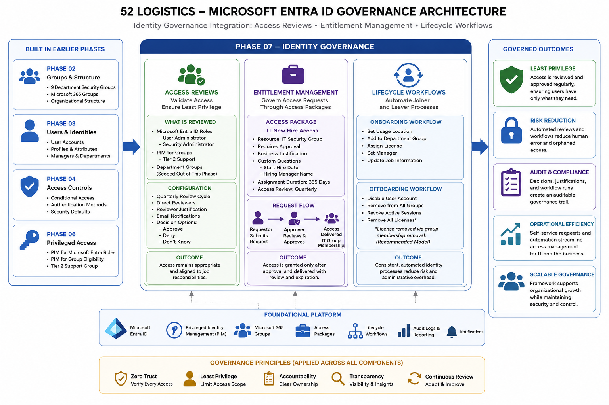

# Identity Governance

I built Phase 06 to defer access reviews on purpose, they belong to Identity Governance, and pulling them into the Privileged Access phase would have blurred a line I wanted to keep clean. This phase is where that deferral gets paid off, along with the two other pieces of the governance domain SC-300 actually tests: entitlement management and Lifecycle Workflows.

## Identity Governance Architecture

  

<i>Figure 1. Access reviews, entitlement management, and Lifecycle Workflows built for the 52 Logistics Microsoft Entra tenant, and how each ties back to earlier phases.</i>

---

## Closing the Loop on Phase 06

The first thing I built was access reviews on the exact PIM assignments I created in Phase 06, User Administrator, Security Administrator, and the Tier 2 Support role-assignable group. Discovered along the way that directory role reviews don't live in the generic Access reviews blade at all, they only get created from inside Privileged Identity Management itself. The generic blade only knows about Teams, Groups, and Applications. Same governance idea, three different creation surfaces depending on what's actually being reviewed.

I hit a real trap building the Security Administrator review. The Reviewers field defaulted toward a "Manager" option that routes the review to whatever's sitting in a user's profile Manager field, with a fallback reviewer if that field is empty, which is where my own name showed up before I caught it and corrected it to a direct reviewer assignment. Worth catching, since it would have quietly routed a sensitive role's review through the wrong mechanism entirely.

Running the Tier 2 Support review surfaced something I hadn't planned for. Jordan's PIM eligibility for that group had expired, a direct result of the short same-night window I deliberately used back in Phase 06. My first instinct was adding him as a standing member instead of dealing with PIM again. Caught myself before doing it, that would have quietly undone the entire point of the scenario. Fixed it the right way, re-added through PIM with a full one-year eligibility window.

Also learned that self-review on a PIM-for-Groups object works differently than self-review on a directory role. Jordan couldn't respond to the Tier 2 Support review at all until he actually activated his group membership first. The Microsoft Entra role reviews needed no such activation. Same underlying feature, genuinely different behavior depending on what's being reviewed.

All three reviews are closed with real decisions behind them, not just configured and left sitting. Jordan self-approved User Administrator and, after activating, Tier 2 Support. I approved his Security Administrator eligibility directly. Confirmed afterward that nothing changed for any of the three assignments, exactly the expected outcome for an Approve decision.

I scoped access reviews on the remaining nine department groups from Phase 02 out of this phase entirely. It's the identical pattern already proven against Tier 2 Support, with nothing new to demonstrate by repeating it nine more times.

---

## Modernizing Onboarding with Entitlement Management

Phase 02 walked through onboarding Christopher Young by hand, creating his account, assigning licenses, setting his manager, one click at a time. This phase builds the governed version of the same business problem. I built a catalog, 52 Logistics Onboarding, added the IT security group as a resource, and built an access package, IT New Hire Access, that lets someone request IT group membership through a governed request instead of an admin clicking through every step by hand.

I initially left the package's Requests tab misconfigured, only Admin checked, Self unchecked, which meant there was no actual self-service path at all. Caught it before creating the package. The final configuration requires approval, a business justification, and answers to two custom questions, Start Hire Date and Hiring Manager Name, so the request carries real context, not a rubber stamp. Assignments expire after 365 days with a quarterly access review attached to the package itself, the exact same governance pattern I used on the PIM roles above, applied here to package membership instead of role eligibility.

Jordan requested the package through myaccess.microsoft.com, listing Sofia Martinez as his hiring manager, the same manager Christopher Young reported to back in Phase 02. I approved it, also through myaccess.microsoft.com, which turned out considerably faster than digging through the admin center's package-specific Requests screen. Worth noting the request sat pending for a noticeable stretch before becoming actionable, entitlement management requests route through backend provisioning before an approval action is even available, a real processing delay worth planning around. The request also carried a default 14-day decision window I hadn't configured myself, Microsoft's own safety net against a request sitting unanswered forever.

Confirmed the full chain worked. Status moved from Approved to Delivered, two distinct checkpoints, and Jordan actually landed in the IT group when I checked directly. The whole flow, request, approval, delivery, membership, is real evidence, not a walkthrough.

---

## Automating Joiner and Leaver Tasks

Phase 02 documented the joiner and leaver process both by hand and through PowerShell automation. This phase adds the platform-native alternative, two Lifecycle Workflows scoped to the IT department.

The onboarding workflow took four runs to get clean, and the four-run trail is stronger evidence than a single clean pass would have been. Run one failed because Daniel Kim's manager email wasn't populated, which cascaded into two unrelated downstream tasks canceling entirely, a real architecture detail worth knowing, Lifecycle Workflows runs its tasks sequentially, and one failure blocks everything queued behind it regardless of whether the later tasks actually depend on the one that failed. Run two fixed the manager email and hit a second gap, a missing employeeHireDate. Run three confirmed it wasn't a fluke. Run four, with both attributes backfilled, completed clean. This traces straight back to a warning already sitting in Phase 02's user-properties.md, that incomplete profiles quietly break things downstream. Three phases later, here's the proof.

The offboarding workflow surfaced something more interesting than a clean pass would have. Three of four tasks completed without issue, but Remove all licenses for user failed with a specific, useful error, the license was inherited from group membership and couldn't be stripped directly from the user account. Checked Maya Chen's account afterward and found the license was already gone, removed as a side effect of the group-removal task that ran two steps earlier. That's not a workflow defect. It's proof that group-based licensing turns offboarding into a built-in safety net, pull someone from their licensed group and the license goes with them automatically, no separate cleanup step required.

That finding is strong enough that I'm treating it as a real architectural recommendation for 52 Logistics, not a one-off curiosity. Moving licensing to a group-based model tenant-wide, tied to the same department groups from Phase 02, is scoped out as a documented enhancement, not built tonight, the same deliberate-deferral pattern I've used for WHFB, FIDO2, and the still-outstanding Phase 04 CA policy template script.

---

## Real-World Friction

Full detail on every finding is in decisions.md, but the shape of it is worth stating here plainly. This phase hit a licensing quirk where the Governance Add-on trial stacks on existing P2 licenses instead of provisioning its own pool, a reviewer-type trap that could have misrouted a sensitive role's review, an expired PIM eligibility window that nearly got worked around with standing access instead of fixed properly, an entitlement management request pipeline slower than PIM's activation flow, and two Lifecycle Workflows runs that surfaced two genuinely different classes of real problem, one a data-completeness gap, one a licensing architecture insight worth building toward on purpose.

None of that got smoothed over. Every one of these is documented as it actually happened, in the order it happened, because that's what makes this project read as a real record of securing a tenant instead of a checklist of settings changed.